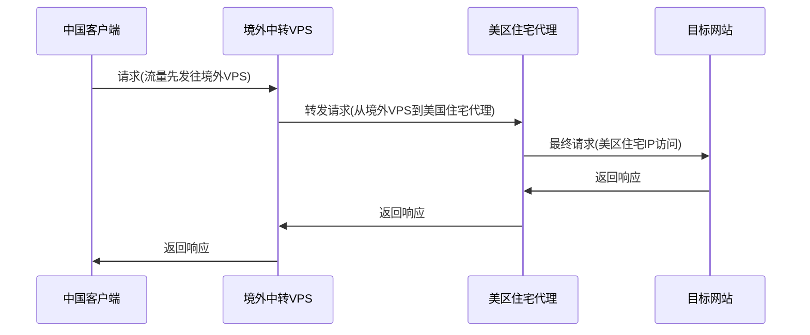
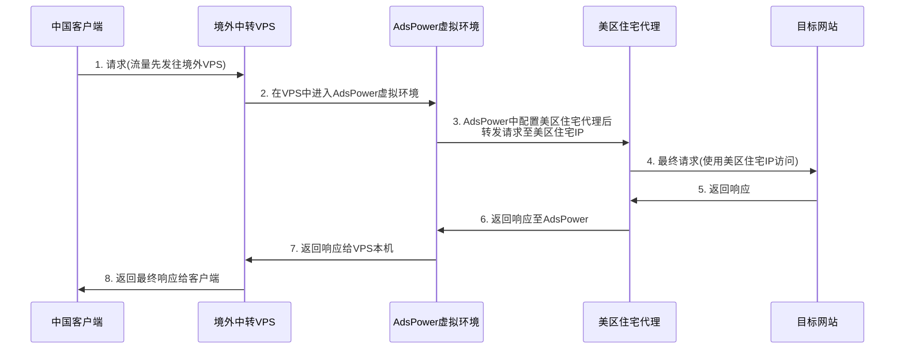

# 配置住宅代理

## 流程介绍

有些场景下需要追求极致干净的IP，比如一些美区APP（Chatgpt类似）需要更为干净的IP代理。

因此购买美区住宅代理用来伪装成一个美国普通公民。

但是美区住宅IP代理静止大陆IP访问。所以，需要两程中转才能发送请求

正常流程如上，但是很明显一台主机如果没有环境隔离，同一时刻只能使用一个代理，所以如果想用两个代理，就需要一个额外的工具实现一个虚拟环境，再为这个虚拟环境配置美区住宅代理，这时候就可以使用**AdsPower** ，**AdsPower**实现在代理之上创建一个虚拟环境，同时也支持配置代理功能。因此能实现我的需求

## 具体操作

1. 配置境外中转的VPS

   配置境外中转的VPS,其实就是开梯子，相信我不用给各位老司机介绍了。

2. Adspower虚拟环境

   实际就是下载一个软件，这里是它的[下载链接](https://share.adspower.net/ZdMfcK)，注册安装下载即可。

3. 配置美区住宅代理

   搜索了目前性价比最高的住宅代理，可以点链接直接买。美区静态住宅代理，价格略贵，40￥/月,但是确实是市面上的均价。

   [美区住宅代理购买链接](https://referral.ipfoxy.com/Vz8Ju8)

   

购买后从静态代理管理中选择提取静态代理信息

4. Adspower 中添加代理

   

代理管理中添加代理，按照步骤来选择添加Ipfoxy的代理即可，最后启动环境。

## 测试

### IP测试

### Chatgpt测试

## 结束

自从换了美区住宅代理，之前Chatgpt交互产生的输入不了汉字，降智打不开canvas都没有发生过了，体验原生Chatgpt确实很舒服。

